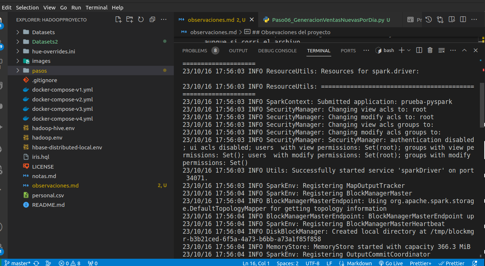

## Obsevaciones del proyecto

A continuación mostrare los problemas que tuve.

- No logre conectar la parte de pyspark con el spark-master por lo que corri el problema en otro servidor para poder realizar el etl

- En el paso 3 se modifico el archivo, ya que habian errors de sintaxis

- en la parte de neo4j el ejemplo de logistica estaba desactualizado, y no corre con las nuevas versiones. entrando a neo4j se cambio por la sintaxis utilizada y funciono correctamente

- finalmente en la parte de carga incremental no ejecute el comando final aunque si corri el archivo

- No realizé la parte de airflow ya que no contaba con el tiempo suficiente para investigarla

