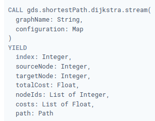
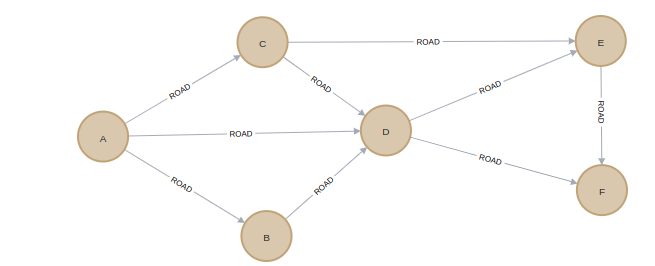
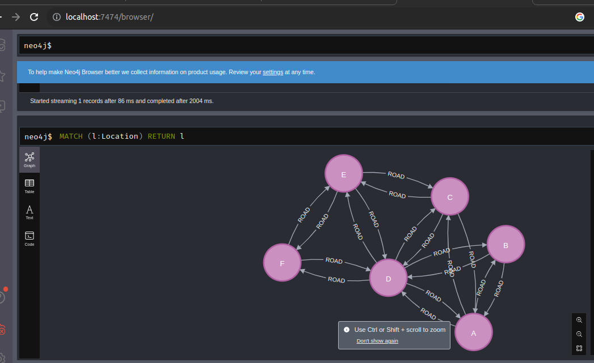

## Dijkstra problem

El algoritmo de ruta más corta de Dijkstra calcula la ruta más corta entre nodos. El algoritmo admite gráficos ponderados con ponderaciones de relación positivas. El algoritmo Fuente-Destino de Dijkstra calcula la ruta más corta entre un nodo de origen y un nodo de destino. Para calcular todas las rutas desde un nodo de origen hasta todos los nodos accesibles, se puede utilizar Dijkstra Single-Source .

### Ejecute Dijkstra en modo de transmisión en un gráfico con nombre.

# Sintaxis
  

### Explicacion 
- graphName:  el nombre de un gráfico almacenado en el catálogo
- configuration : Configuración para algoritmos específicos y/o filtrado de gráficos.
- nodeLabels : etiqueta del nodo
- relationshipTypes : tipo de relacion
- sourceNode : la raiz del nodo de neo4j o nodo id
- targetNode : nodo objetivo

- index : numeros naturales iniciados desde cero
- totalCost : costo total desde el origen hasta el target
- nodeIds :  lista de ids ID de nodo en la ruta en orden transversal.

## Ejecucion

