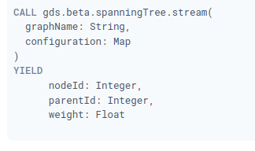

### Minimum Weight Spanning Tree

El árbol de expansión de peso mínimo (MST) comienza desde un nodo determinado, encuentra todos sus nodos alcanzables y devuelve el conjunto de relaciones que conectan estos nodos con el mínimo peso posible. El algoritmo de Prim es uno de los algoritmos de árbol de expansión mínima más simples y conocidos. Funciona de manera similar al algoritmo de ruta más corta de Dijkstra , pero en lugar de minimizar la longitud total de una ruta que termina en cada relación, minimiza la longitud de cada relación individualmente. Esto permite que el algoritmo funcione en gráficos con pesos negativos.

### Casos de uso

- Se utilizaron árboles de expansión mínima para analizar las conexiones aéreas y marítimas de Papua Nueva Guinea y minimizar el costo de viaje para explorar el país. Por ejemplo, se utilizaron para ayudar a diseñar recorridos de bajo costo que visitan muchos destinos en todo el país. Consulte "Una aplicación de árboles de expansión mínima a la planificación de viajes" .

- Se han utilizado árboles de expansión mínima para analizar y visualizar correlaciones en una red de monedas, basándose en la correlación entre los rendimientos de las monedas. Esto se describe en "Aplicación del árbol de expansión mínimo en el mercado de divisas" .

- Los árboles de cobertura mínima también han demostrado ser una herramienta útil para rastrear la transmisión de infecciones en brotes. Consulte Uso del modelo de árbol de expansión mínima para la investigación epidemiológica molecular de un brote nosocomial de infección por el virus de la hepatitis C.

## Sintaxis del árbol de expansión por modo

### Sintaxis	CREATE (a:Place {id: 'A'}),
       (b:Place {id: 'B'}),
       (c:Place {id: 'C'}),
       (d:Place {id: 'D'}),
       (e:Place {id: 'E'}),
       (f:Place {id: 'F'}),
       (g:Place {id: 'G'}),
       (d)-[:LINK {cost:4}]->(b),
       (d)-[:LINK {cost:6}]->(e),
       (b)-[:LINK {cost:1}]->(a),
       (b)-[:LINK {cost:3}]->(c),
       (a)-[:LINK {cost:2}]->(c),
       (c)-[:LINK {cost:5}]->(e),
       (f)-[:LINK {cost:1}]->(g);

