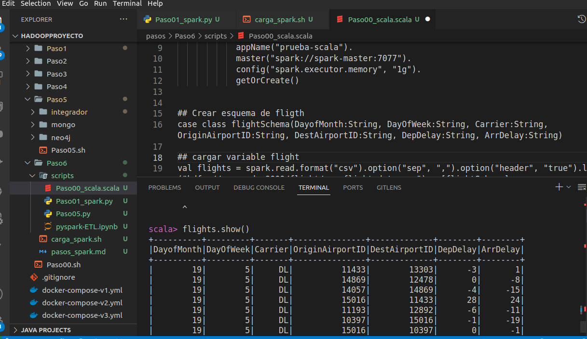

## Ubicarse en la línea de comandos del Spark master y comenzar PySpark.

- docker exec -it spark-master bash

- /spark/bin/pyspark --master spark://spark-master:7077

## Ejecucion escala

- Luego de ejecutar los comandos de Paso00_scala.scala en el cual se crea un esquema con los vuelos 

